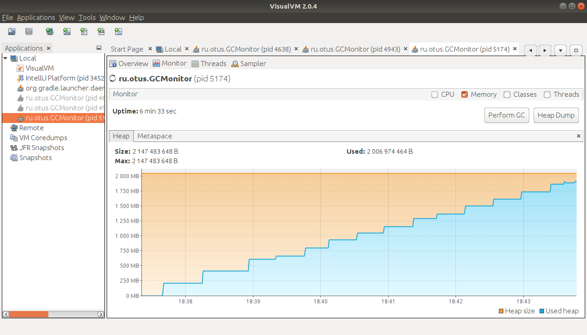
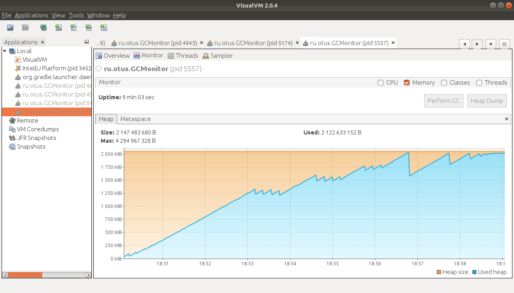

ZGC сборщик мусора

G1 сборщик мусора

<table>
<caption>Сборщики мусора (time - время в секундах до падения тестировщика при разных размерах кучи,
критическая точка - время в секундах)</caption>
<tr><th>GC</th><th>256m time</th><th>2048m time</th><th>критическая точка</th><th>критическая точка GC</th><th>падение, время GC</th></tr>
<tr><td>G1</td><td>65</td><td>540</td><td>408</td><td>3547</td><td>23601</td></tr>
<tr><td>ZGC</td><td>51</td><td>417</td><td>380</td><td>2921</td><td>17715</td></tr>
</table>

Попробовал отследить начало каких-то изменений в поведении сборщиков для кучи в 2048Мб 
критическая точка: 
для G1 - первая дефрагментация Old поколения (случилось, когда память кучи уже была занята). 
для ZGC - первое событие "High Usage" (случилось, когда размер ZHeap увеличился до размера кучи). 
"High Usage" в ZGC из <a href="https://bugs.openjdk.java.net/browse/JDK-8224185">openjdk</a>  Perform GC if the amount of free memory is 5% or less. 
 
критическая точка GC - сколько сборщик проработал в милисекундах до прихода в условную критическую точку. 
падение, время GC - какое время в милисекундах потратил GC до падения. 
 
Можно пронаблюдать, как сборщики мусора после достижения потолка кучи начинают съедать машинное время на дополнительные операции по удалению ненужных блоков и по дефрагментации оставшихся (разность между "время падения, GC" и "критическая точка, GC" )
 
 
Преимущество G1 сборщика перед прежними поколениями заключается в том, что он уделяет дефрагментации установленные моменты времени.
По логу видно, что в период, когда необходимости в новой памяти нет (файлы приложены), он занимается young областями. Когда в памяти появляется существенная нужда, начинается уничтожение Old поколения.

Сборщик ZGC появился позднее. А с версии Java 15 можно использовать его без ключа -XX:+UnlockExperimentalVMOptions.
ZGC берёт полный контроль над Кучей, отсюда и лестницеподобный график занимаемой памяти в VisualVm (У ZGC определена своя область кучи, ZHeap, приложил в логах). У ZGC может в onlinetime дефрагментизировать память и посредством специальных барьеров, при необходимости давать указатели приложению.

По сравнению с G1 на моём ноутбуке у ZGC есть небольшое преимущество. В случае кучи в 2048Mb, порядка минуты. Но G1 не преодолел ни разу в скорости, на моём тесте, ZGC сборщик ни на одном размере кучи.
 
Работая в параллельном основному потоку приложения потоке, ZGC, хотя и отнимает некоторые ресурсы системы, но действует вполне эффективно.

<table border="0" cellspacing="0" cellpadding="0" class="ta1"><colgroup><col width="115"/><col width="209"/><col width="200"/><col width="217"/><col width="209"/></colgroup><tr class="ro1"><td style="text-align:left;width:26.23mm; " class="Default"> </td><td style="text-align:left;width:47.73mm; " class="Default">
mean duration (critical point)
</td><td style="text-align:left;width:45.83mm; " class="Default">
mean duration (memory error)
</td><td style="text-align:left;width:49.64mm; " class="Default">
max duration (critical point)
</td><td style="text-align:left;width:47.73mm; " class="Default">
max duration (memory error)
</td></tr><tr class="ro1"><td style="text-align:left;width:26.23mm; " class="Default">
G1 (256Mb)
</td><td style="text-align:right; width:47.73mm; " class="Default">
18,77
</td><td style="text-align:right; width:45.83mm; " class="Default">
35,17
</td><td style="text-align:right; width:49.64mm; " class="Default">
125
</td><td style="text-align:right; width:47.73mm; " class="Default">
157
</td></tr><tr class="ro1"><td style="text-align:left;width:26.23mm; " class="Default">
ZGC (256Mb)
</td><td style="text-align:right; width:47.73mm; " class="Default">
51,43
</td><td style="text-align:right; width:45.83mm; " class="Default">
41,14
</td><td style="text-align:right; width:49.64mm; " class="Default">
63
</td><td style="text-align:right; width:47.73mm; " class="Default">
63
</td></tr><tr class="ro1"><td style="text-align:left;width:26.23mm; " class="Default">
G1 (2048Mb)
</td><td style="text-align:right; width:47.73mm; " class="Default">
113
</td><td style="text-align:right; width:45.83mm; " class="Default">
265,36
</td><td style="text-align:right; width:49.64mm; " class="Default">
859
</td><td style="text-align:right; width:47.73mm; " class="Default">
1120
</td></tr><tr class="ro1"><td style="text-align:left;width:26.23mm; " class="Default">
ZGC (2048Mb)
</td><td style="text-align:right; width:47.73mm; " class="Default">
170,2
</td><td style="text-align:right; width:45.83mm; " class="Default">
134,87
</td><td style="text-align:right; width:49.64mm; " class="Default">
219
</td><td style="text-align:right; width:47.73mm; " class="Default">
219
</td></tr></table>

Судя по средним значениям задержки на действия сборщика, ZGC с подходом к пределу кучи начал ускоряться, тратя меньше времени на свои операции.
Сравнивая средние значения задержек с максимальными, можно сказать, что ZGC ведёт себя стабильнее. Можно не опасаться резких пауз в работе приложения из-за сборки мусора.
Если взять отрезок времени, когда памяти приложению хватало, то пауза G1 сборщика в этот период нарастала с увеличением занятости кучи. А ZGC занимал у приложения примерно одно и то же время.
ZGC показал себя более надёжным решением, в сравнении с G1 сборщиком мусора. 